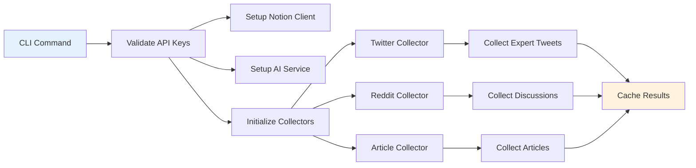
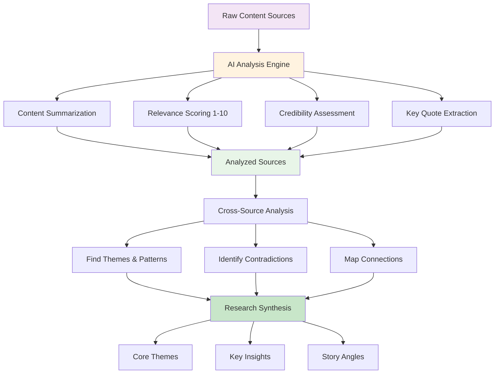
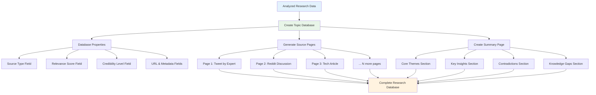
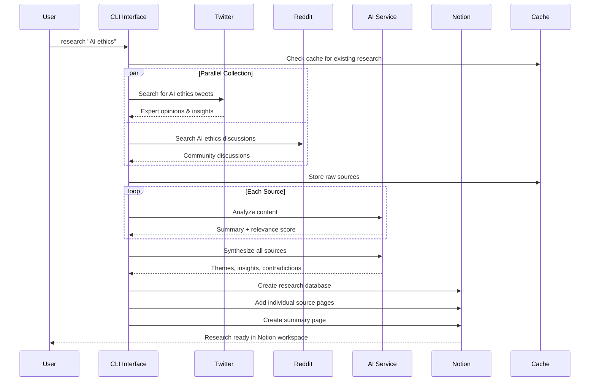
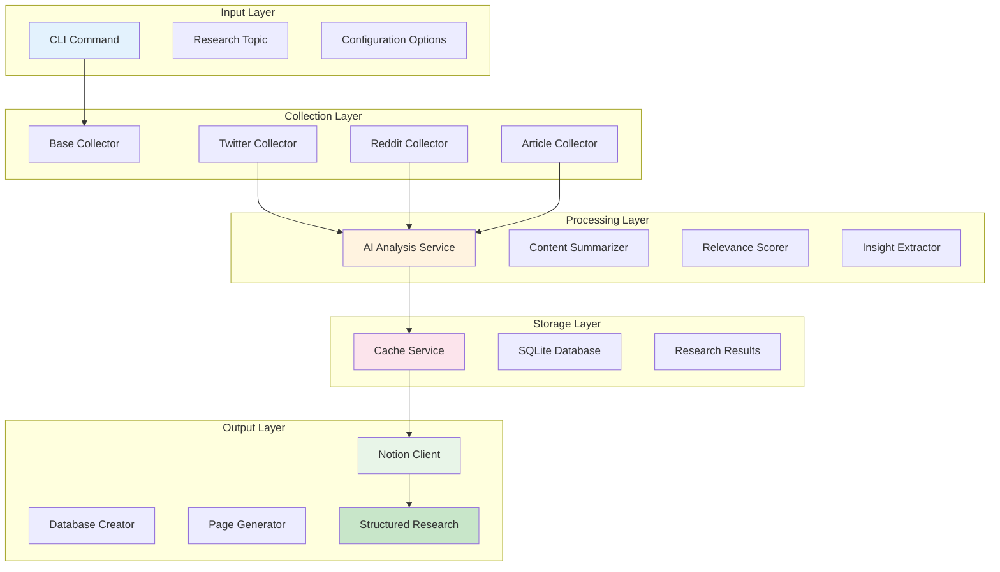
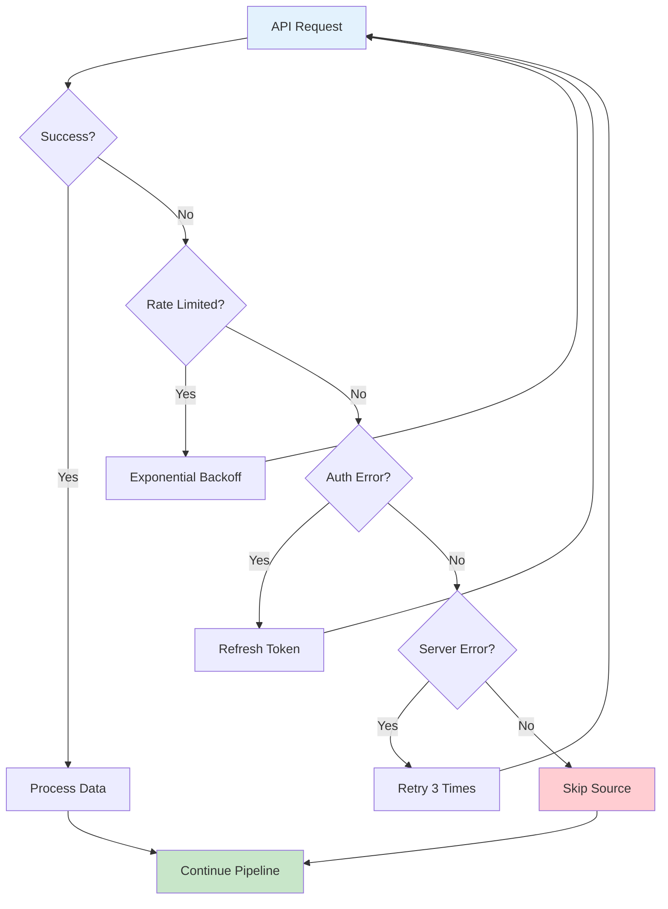
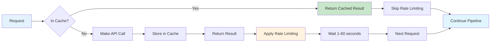

# Deep Research Bot - Workflow Diagram (Mermaid)

## 🔄 Complete Bot Workflow

```mermaid
graph TD
    A[User: "npm run start -- research 'AI ethics'"] --> B[Config Validation]
    B --> C[Initialize Services]

    C --> D[Generate Search Queries]
    D --> E{Multi-Platform Collection}

    E --> F[Twitter API]
    E --> G[Reddit API]
    E --> H[RSS Feeds]
    E --> I[Web Scraping]

    F --> J[Tweets & Expert Opinions]
    G --> K[Discussions & Comments]
    H --> L[Tech Blog Articles]
    I --> M[Web Content]

    J --> N[Raw Sources Pool]
    K --> N
    L --> N
    M --> N

    N --> O[AI Content Analysis]
    O --> P[Summarize & Score Relevance]
    P --> Q[Extract Key Insights]
    Q --> R[Find Connections Between Sources]

    R --> S[Research Synthesis]
    S --> T[Identify Core Themes]
    S --> U[Detect Contradictions]
    S --> V[Find Knowledge Gaps]

    T --> W[Research Summary]
    U --> W
    V --> W

    W --> X[Create Notion Database]
    X --> Y[Generate Source Pages]
    X --> Z[Create Summary Page]

    Y --> AA[Structured Research in Notion]
    Z --> AA
    AA --> BB[Ready for Thinkpiece Writing]

    style A fill:#e1f5fe
    style O fill:#fff3e0
    style S fill:#c8e6c9
    style X fill:#e8f5e8
    style AA fill:#fff3e0
    style BB fill:#e1f5fe
```

## 📋 Phase Breakdown

### Phase 1: Setup & Collection


### Phase 2: AI Processing Pipeline


### Phase 3: Notion Integration


## ⚡ Data Flow Sequence



## 🎯 Core Architecture Components



## 🔍 Error Handling Flow



## 📊 Output Structure Example

```mermaid
graph TD
    A[User's Notion Workspace] --> B[Research Database: "AI Ethics"]

    B --> C[Source Page 1]
    C --> D["🐦 Tweet: @tech_expert<br/><strong>TL;DR:</strong> AI bias is systemic<br/><strong>Score:</strong> 9/10<br/><strong>Key Quote:</strong> "We build bias into systems..."]

    B --> E[Source Page 2]
    E --> F["🤖 Reddit: r/technology<br/><strong>TL;DR:</strong> Community discusses AI accountability<br/><strong>Score:</strong> 7/10<br/><strong>Key Quote:</strong> "Who watches the watchers?"]

    B --> G[Source Page 3]
    G --> H["📄 Article: TechCrunch<br/><strong>TL;DR:</strong> Industry perspective on AI regulation<br/><strong>Score:</strong> 8/10<br/><strong>Key Quote:</strong> "Balance innovation and safety..."]

    B --> I[📊 Research Summary Page]
    I --> J["<strong>Core Themes:</strong> Bias, Accountability, Regulation<br/><strong>Key Insights:</strong> 5 major findings<br/><strong>Contradictions:</strong> Innovation vs Safety<br/><strong>Story Angles:</strong> 3 potential narratives"]

    style A fill:#e1f5fe
    style B fill:#e8f5e8
    style I fill:#fff3e0
```

## ⚡ Performance Optimizations



This workflow shows how the bot transforms a simple research topic into a comprehensive, AI-analyzed database in Notion - essentially automating hours of manual research into minutes of processing!