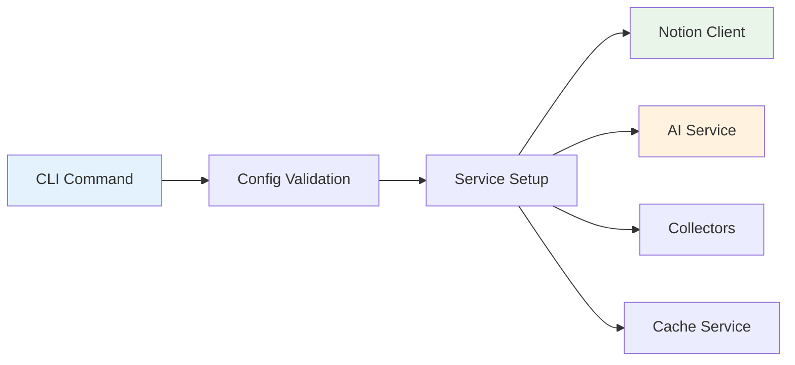
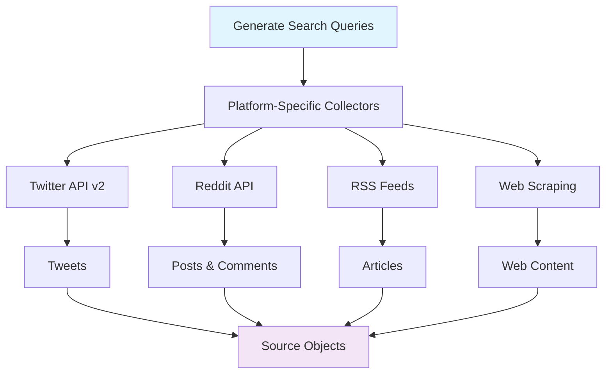
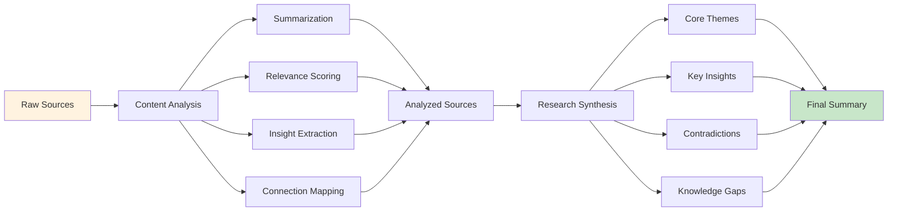
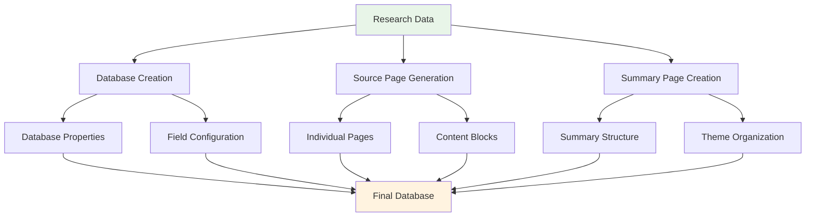
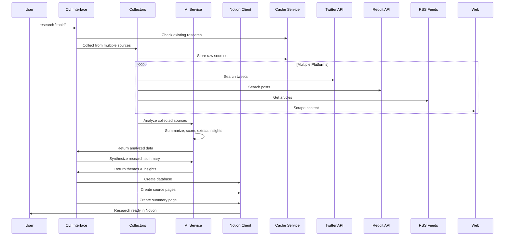
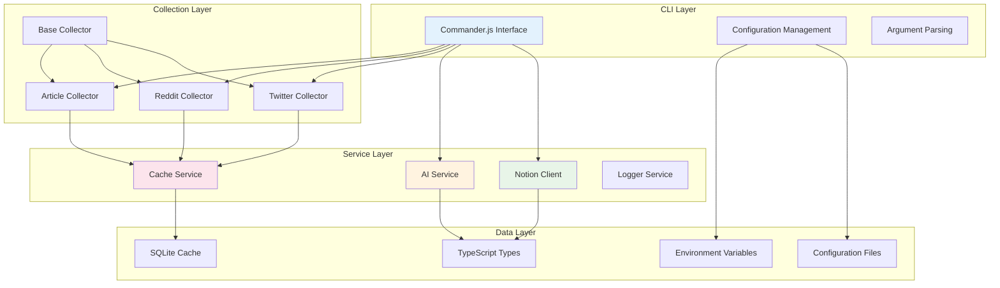
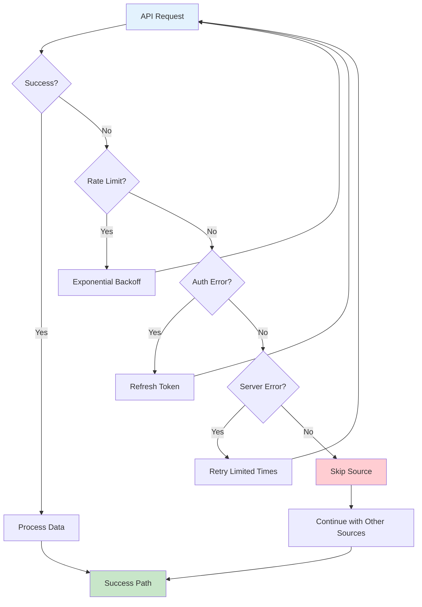

# Deep Research Bot - Workflow Diagram

## 🔄 Complete Workflow Flow

```mermaid
graph TD
    A[User Input: Research Topic] --> B[CLI Command: npm run start -- research "topic"]
    B --> C[Configuration Validation]
    C --> D[Initialize Services]

    D --> E[Notion Client]
    D --> F[AI Service]
    D --> G[Collectors]
    D --> H[Cache Service]

    C --> I[Search Strategy Generation]
    I --> J[Multi-Platform Search Queries]

    J --> K[Twitter Collector]
    J --> L[Reddit Collector]
    J --> M[Article Collector]
    J --> N[Web Scraper]

    K --> O[Tweets Analysis]
    L --> P[Posts/Comments Analysis]
    M --> Q[Article Content Extraction]
    N --> R[Web Content Extraction]

    O --> S[Source Objects]
    P --> S
    Q --> S
    R --> S

    S --> T[Caching Layer]
    T --> U[AI Content Analysis]

    U --> V[Content Summarization]
    U --> W[Relevance Scoring]
    U --> X[Insight Extraction]
    U --> Y[Connection Mapping]

    V --> Z[Analyzed Sources]
    W --> Z
    X --> Z
    Y --> Z

    Z --> AA[Research Synthesis]
    AA --> BB[Core Themes Identification]
    AA --> CC[Key Insights Generation]
    AA --> DD[Contradictions Analysis]
    AA --> EE[Knowledge Gaps Detection]

    BB --> FF[Research Summary]
    CC --> FF
    DD --> FF
    EE --> FF

    FF --> GG[Notion Database Creation]
    Z --> HH[Individual Source Pages]

    GG --> II[Database Structure Setup]
    HH --> JJ[Page Generation]

    II --> KK[Properties & Fields]
    JJ --> LL[Content Blocks & Formatting]

    KK --> MM[Database Upload]
    LL --> MM
    MM --> NN[Final Notion Database]

    NN --> OO[User Review in Notion]
    OO --> PP[Thinkpiece Writing]

    style A fill:#e1f5fe
    style PP fill:#c8e6c9
    style NN fill:#fff3e0
    style Z fill:#f3e5f5
```

## 📋 Detailed Phase Breakdown

### Phase 1: Initialization


### Phase 2: Data Collection


### Phase 3: AI Processing


### Phase 4: Notion Integration


## 🔄 Data Flow Pipeline



## 🎯 Core Components Architecture



## ⚡ Processing Pipeline



```mermaid
graph LR
    A[Input Topic] --> B[Query Generation]
    B --> C[Parallel Collection]
    C --> D[Rate Limited Requests]
    D --> E[Content Extraction]
    E --> F[AI Analysis]
    F --> G[Quality Filtering]
    G --> H[Relevance Ranking]
    H --> I[Research Synthesis]
    I --> J[Notion Upload]
    J --> K[Database Ready]

    style A fill:#e1f5fe
    style F fill:#fff3e0
    style K fill:#c8e6c9
```

## 🎪 Error Handling Flow



This workflow shows how the bot transforms a simple topic request into a comprehensive, AI-analyzed research database in Notion - automating hours of manual research work into minutes of automated processing.